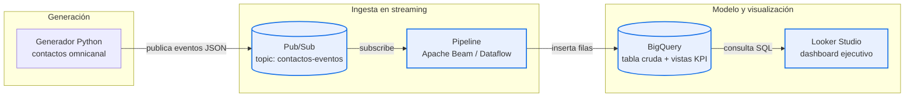

# Torre de Control — Contact Center Analytics

Pipeline de analítica en tiempo real para un contact center omnicanal de retail,
diseñado sobre Google Cloud (Pub/Sub, BigQuery, Looker Studio) y ejecutable
localmente mediante emuladores. Demuestra el patrón de ingesta event-by-event,
modelado de KPIs operacionales (SLA, AHT, FCR, abandono, CPO) y visualización
ejecutiva para una "torre de control" — la función que monitorea la operación
en vivo y reacciona a desviaciones.

> Proyecto de portafolio orientado al cargo de **Business Analyst — Digital
> Analytics & BI** en operaciones de atención al cliente retail.

## Contexto y problema

Una **torre de control** en un contact center es la función operativa que
monitorea el servicio en tiempo casi-real, consolida indicadores de fuentes
dispersas (telefonía, canales digitales, dotación de agentes) y dispara acción
correctiva cuando una métrica se sale de rango. No es solo un dashboard:
incluye la disciplina de leerlo, interpretarlo y reaccionar.

Los indicadores que vive monitoreando son, principalmente:

- **Nivel de Servicio (SLA)** — % de contactos atendidos dentro del umbral
  objetivo. El estándar clásico de la industria es el **80/20**: 80% de los
  contactos atendidos en 20 segundos o menos.
- **AHT** (*Average Handle Time*) — tiempo medio de atención por canal.
- **Tasa de abandono** — % de contactos que cuelgan antes de ser atendidos.
- **FCR** (*First Contact Resolution*) — % de casos resueltos en el primer
  contacto, sin requerir rellamada.
- **CPO** (*Contacts Per Order*) — contactos asociados a una orden de compra;
  mide eficiencia del flujo postventa en operaciones e-commerce.
- **Ocupación y adherencia de agentes** — qué tan utilizada está la dotación y
  qué tan apegados están los agentes a su turno planificado.

Este repositorio construye, de punta a punta, la infraestructura que una torre
de control necesita: **un generador de eventos** que simula la llegada de
contactos omnicanal con patrones realistas, **una ingesta en streaming** vía
Pub/Sub, **un modelo de KPIs en BigQuery/SQL**, y **un dashboard en Looker
Studio**. Toda la simulación es ejecutable localmente sin costo, usando el
emulador de Pub/Sub y datos sintéticos.

## Arquitectura



El diseño es **GCP-nativo**: cada pieza encaja directamente en un servicio
gestionado de Google Cloud. Para desarrollo local, el proyecto sustituye los
servicios cloud por sus equivalentes ejecutables:

| Componente cloud | Equivalente local | Decisión |
|---|---|---|
| Pub/Sub real | Emulador oficial de Google (`gcloud beta emulators pubsub`) | Mismo SDK, comportamiento idéntico |
| Dataflow | Apache Beam con runner local (DirectRunner) | Mismo código Beam |
| BigQuery | *(a definir en Módulo 2)* | Sandbox cloud o DuckDB local |
| Looker Studio | *(idem)* | Conector directo o exportación |

Esta dualidad **cloud / local** permite construir, probar y demostrar el
proyecto sin incurrir en costos ni requerir tarjeta de crédito vinculada,
manteniendo el mismo código que correría en producción.

## Cómo correr el proyecto localmente

### Requisitos previos

- macOS, Linux o WSL (Windows con Subsistema Linux).
- **Python 3.11+**.
- **[uv](https://docs.astral.sh/uv/)** como gestor de paquetes y entornos.
- **[Google Cloud SDK](https://cloud.google.com/sdk/docs/install)** con el
  componente `pubsub-emulator` instalado:
```bash
  gcloud components install pubsub-emulator
```
- **Java 11+** (lo requiere el emulador de Pub/Sub, internamente Java).

### Setup inicial

```bash
# 1. Clonar el repositorio
git clone https://github.com/<tu-usuario>/torre-control-contact-center.git
cd torre-control-contact-center

# 2. Crear el entorno e instalar dependencias (uv hace ambas en un paso)
uv sync
```

### Levantar el entorno local (3 terminales)

Por la naturaleza streaming del proyecto, varios procesos corren en paralelo.
Lo más cómodo es una terminal por proceso. Todas las terminales deben estar
paradas en la raíz del repositorio.

**Terminal 1 — Emulador de Pub/Sub:**

```bash
gcloud beta emulators pubsub start --host-port=localhost:8085
```

Deja esta terminal abierta. El emulador queda corriendo en primer plano.

**Terminal 2 — Crear topic y subscripción (una sola vez):**

```bash
export PUBSUB_EMULATOR_HOST=localhost:8085
export PYTHONPATH=.

uv run python scripts/crear_topic_emulator.py
uv run python scripts/crear_subscription_emulator.py
```

Ambos scripts son **idempotentes**: si el topic o la subscripción ya existen,
lo informan sin error.

**Terminal 3 — Correr el generador:**

```bash
export PUBSUB_EMULATOR_HOST=localhost:8085
export PYTHONPATH=.

# 50 eventos a ritmo moderado
uv run python 01_generador/generador_contactos.py --total 50 --tasa 30

# o flujo continuo hasta Ctrl+C, ritmo realista por hora del día
uv run python 01_generador/generador_contactos.py
```

### Verificar que los eventos llegan a la cola

En una **Terminal 4** (mismas exportaciones de entorno), correr el lector:

```bash
uv run python scripts/leer_mensajes_emulator.py
```

Cada evento publicado por el generador debería aparecer simultáneamente en la
salida del lector. Ese ciclo demuestra el pipeline completo de streaming
funcionando end-to-end.

### Argumentos del generador

| Argumento | Default | Descripción |
|---|---|---|
| `--total N` | `0` (infinito) | N° de eventos a publicar antes de terminar. |
| `--tasa X` | `30` | Contactos por minuto en hora peak. Más bajo = más lento. |

La tasa efectiva se ajusta automáticamente según la hora del día (curva
horaria configurada en `config/settings.py`), simulando los peaks reales de
un contact center retail.

## Stack

| Capa | Tecnología | Rol |
|---|---|---|
| Lenguaje | Python 3.11+ | Generador y consumidor |
| Gestor de paquetes | uv | Resolución de dependencias y entornos virtuales |
| Mensajería | Google Cloud Pub/Sub (emulador local) | Cola de eventos en streaming |
| Procesamiento | Apache Beam *(Módulo 2, en progreso)* | Pipeline ETL streaming |
| Data warehouse | BigQuery *(Módulo 2, en progreso)* | Almacenamiento analítico y vistas SQL |
| Visualización | Looker Studio *(Módulo 4, planificado)* | Dashboard ejecutivo |

## Decisiones técnicas

- **Streaming sobre batch.** El cargo apunta a torre de control "en tiempo
  real". Implementar el flujo como `Pub/Sub → pipeline → BigQuery` es el patrón
  GCP-nativo y refleja la realidad operacional; un CSV procesado por lotes no
  habría comunicado lo mismo.

- **Ritmo Poisson, no constante.** Las llegadas se modelan con distribución
  exponencial entre eventos (proceso de Poisson), ajustada por una curva
  horaria realista. Esto produce un flujo irregular con ráfagas y silencios,
  consistente con la dinámica real de un contact center.

- **Coherencia entre campos.** Un contacto abandonado nunca tiene `AHT`, `CSAT`
  ni `FCR`. Esos campos quedan en `NULL`, no en cero. Mantener la integridad
  semántica de los datos es lo que permite que los promedios y porcentajes
  calculados en BigQuery sean correctos; un dataset con ceros falsos contamina
  los KPIs silenciosamente.

- **Configuración separada de lógica.** Catálogos del negocio (canales, colas,
  pesos, AHT base) viven en `config/settings.py` como datos puros. Ajustar el
  comportamiento no requiere tocar el código del generador. Identificadores
  sensibles se leen de variables de entorno.

- **Mismo código local y cloud.** El generador detecta automáticamente la
  variable `PUBSUB_EMULATOR_HOST` y se conecta al emulador local si está
  definida, o a Pub/Sub real si no. Un único codepath sirve para desarrollo
  y producción.

- **uv en lugar de pip + venv.** Resolución de dependencias 10-100× más rápida,
  archivo `uv.lock` con versiones exactas para reproducibilidad, y configuración
  unificada en `pyproject.toml` (estándar moderno PEP 621).

## Estado del proyecto

- ✅ **Módulo 1** — Generador de eventos + ingesta vía Pub/Sub.
- 🚧 **Módulo 2** — Pipeline streaming con Apache Beam hacia BigQuery.
- 🚧 **Módulo 3** — Modelo SQL de KPIs (SLA, AHT, FCR, abandono, CPO, ocupación).
- 🚧 **Módulo 4** — Dashboard en Looker Studio.

## Autor

**Julio** — Business Analyst & Data Professional · Santiago, Chile
[LinkedIn](https://www.linkedin.com/in/<tu-usuario>) · [GitHub](https://github.com/<tu-usuario>)